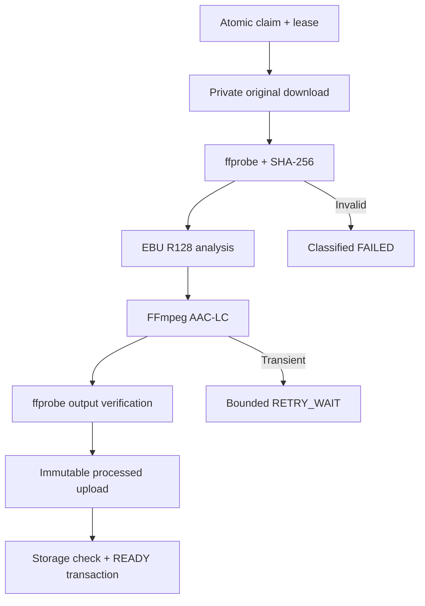
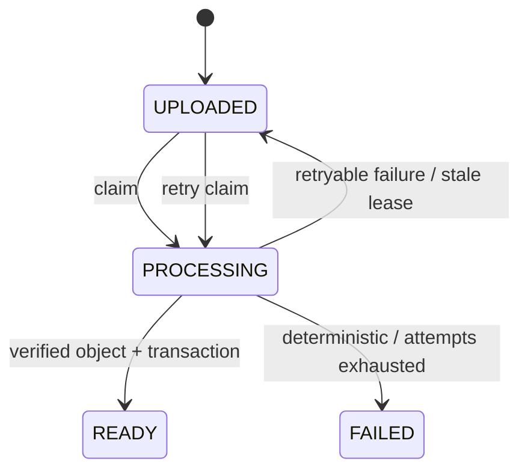

# ترتيل — Audio Processing Worker

## 1. Scope and boundaries

`services/audio-worker` خدمة مستقلة طويلة التشغيل؛ ليست داخل Next.js request lifecycle. تعالج فقط media المملوكة/المدارة التي أكملت upload وأصبحت `UPLOADED`. External Stations لا تدخل هذه pipeline مطلقًا. PostgreSQL هو مصدر حقيقة الحالة، وStorage هو مخزن bytes.



## 2. State model



Job state مستقل: `PENDING`, `PROCESSING`, `RETRY_WAIT`, `COMPLETED`, `FAILED`, `CANCELLED`. Attempt state: `PROCESSING`, `COMPLETED`, `FAILED`, `ABANDONED`. Upload وحده لا يصل إلى READY.

## 3. Claim, lease and fencing

`claim_media_processing_job` ينفذ داخل transaction واحدة:

1. يقفل job قابلة للمحاولة بـ`FOR UPDATE SKIP LOCKED`، أو يقفل media `UPLOADED` لا تملك job للـprofile.
2. ينشئ/يحدّث job، يزيد `attempts` و`claim_token`، ويضبط media إلى `PROCESSING`.
3. ينشئ attempt مرتبطة بنفس token ويعيد source/profile config.

الإعداد الافتراضي DEVELOPMENT: lease خمس دقائق، heartbeat كل 30 ثانية، وفحص stale jobs كل 60 ثانية. كل heartbeat/finalize/failure يشترط `worker_id + job_id + attempt_id + claim_token`. Worker قديم لا يستطيع الكتابة بعد reclaim حتى لو استمر FFmpeg فعليًا. Recovery يبحث عن `lease_expires_at <= now()` بـSKIP LOCKED؛ يعيد job إلى `RETRY_WAIT` أو `FAILED` عند exhaustion، ويعلّم attempt `ABANDONED`.

قفل الصف قصير: لا يبقى PostgreSQL transaction مفتوحًا أثناء download/FFmpeg/upload. Index claim يبدأ بـ`profile_id` ثم priority/due time. PostgreSQL queue كافية للـMVP؛ لا Redis/Kafka.

## 4. ffprobe and source validation

المصدر الحقيقي للـallowlist هو `storage_upload_formats`: extension+MIME، format names المكتشفة، codecs، والحجم. لا توجد allowlist ثانية مستقلة داخل Business Logic.

يفحص Worker:

- Container/codec، duration، audio/video streams، sample rate، channels، bitrate، stream count.
- حجم الملف الفعلي مقابل DB، ومفتاح object مقابل `media_id`.
- audio stream واحدة في MVP؛ يرفض no-audio، multiple-audio، video، corruption، zero duration، encrypted/protected hints، codec/container غير المعتمد، ومدة تتجاوز profile.
- MIME البديل المسموح لنفس extension ليس failure إذا كان upload record وffprobe متوافقين. تعارض real format/codec مع extension policy هو `UNSUPPORTED_FORMAT`.

Formats الحالية: MP3/MP3، M4A/AAC، AAC/ADTS AAC، WAV مع PCM 16/24/32-bit أو float32، وFLAC/FLAC. Audio+Video مرفوض بدل استخراج الصوت لتقليل غموض الحقوق والمحتوى في MVP.

## 5. Processing profile

Profile التنفيذية `AUDIO_STANDARD_V1:v1` مخزنة relational في `processing_profiles`:

| الخاصية | القيمة |
|---|---:|
| Codec/container | AAC-LC داخل M4A/MP4 Audio |
| Bitrate | 96 kbps target |
| Sample rate | 44.1 kHz |
| Channels | Stereo |
| Loudness | EBU R128 two-pass |
| Target integrated | -16 LUFS |
| True peak | -1.5 dBTP |
| LRA | 11 LU |
| Max duration DEVELOPMENT | 60 minutes |
| Max output | 50 MiB |

AAC-LC/M4A اختير لتوافق Android/iOS وجودة جيدة عند 96 kbps. Icecast playout لاحقًا يفك master ويغذي source مستمرة؛ التطبيق لا يستخدم processed object لتقليد live. Device/listening matrix تظل مطلوبة قبل production.

Two-pass `loudnorm` يحلل الملف كاملًا ثم يمرر measurements إلى pass الترميز. لا trim، tempo، pitch، crossfade، effects، chapter reorder أو automatic silence removal. FFmpeg يقرأ audio stream الأولى فقط بعد تحقق أنه لا توجد streams إضافية غير مقبولة، ويزيل metadata/chapters غير الضرورية دون تغيير الزمن.

## 6. Safe subprocess and resource policy

- `spawn(executable, args)` مع `shell:false`؛ لا يجمع user input داخل command string.
- input/output paths مولدة داخل workspace عشوائية تحت `/tmp/tarteel/audio-worker` ولا تستخدم filename الأصلي.
- environment مصغرة، `-nostdin`, `-vn`, `-sn`, `-dn`، stderr محدود 32 KiB ومُنقح قبل logging.
- ffprobe timeout 30 ثانية، كل FFmpeg pass 900 ثانية، concurrency=1 في DEVELOPMENT، max attempts=3؛ جميعها environment/config.
- input bucket 50 MiB، profile duration/output limits، stream count أقصى 8. Container يعمل non-root.
- cleanup في `finally` للنجاح والفشل والtimeout. Crash قسري يترك directory محتملًا؛ startup janitor مؤجل ويجب ألا يحذف directory حديثة لعامل حي.

## 7. Storage and object identity

Original download يستخدم trusted server Storage access؛ لا Public URL ولا signed URL في logs. Output immutable مع `upsert=false`:

```text
media/{media_id}/processed/audio-standard-v1/v1/{attempt_id}.m4a
```

بعد upload، `complete_media_processing_job` يقرأ metadata من `storage.objects` فقط للتحقق، ولا يعدّل Storage schema. يفحص bucket/key/version/size/MIME وSHA-256 في user metadata، profile fields، duration tolerance (`max(250ms, 0.1%)`)، ثم ينشئ `processed_media_variants` ويقلب job/media إلى COMPLETED/READY في transaction واحدة.

إذا حدث crash بعد upload وقبل DB commit، المحاولة الجديدة تكتب key جديدة؛ الناتج السابق orphan قابل للتنظيف ولا يُستبدل. إذا response النهائي ضاع بعد commit، Worker يقرأ job ويعتبر COMPLETED idempotent. لا upsert للbytes.

## 8. Checksum and metadata

SHA-256 للأصل والناتج يحسب streaming من القرص. الأصل يخزن في `media.sha256` وattempt؛ يوجد non-unique index لاكتشاف duplicates دون منع الاستخدام المشروع. نخزن فقط metadata الموثوقة: detected format/codec/duration/sample rate/channels/source bitrate/size، timings، وdiagnostics صغيرة. لا نخزن ffprobe JSON الخام أو stderr الكامل.

## 9. Error and retry policy

| التصنيف | Retry |
|---|---|
| INVALID_MEDIA / CORRUPT_INPUT / NO_AUDIO_STREAM | لا |
| UNSUPPORTED_FORMAT / VIDEO_STREAM_REJECTED / DURATION_LIMIT_EXCEEDED | لا |
| INPUT_SIZE_MISMATCH / OBJECT_KEY_MISMATCH | لا؛ integrity/security |
| DOWNLOAD_FAILED / STORAGE_FAILED / DATABASE_FAILED | نعم، bounded |
| FFPROBE_TIMEOUT / PROCESSING_TIMEOUT | نعم حتى max attempts |
| FFPROBE_FAILED / FFMPEG_FAILED / OUTPUT_INVALID | لا افتراضيًا |
| WORKER_INTERNAL_ERROR / stale crash | نعم حتى max attempts |

Backoff أسي يبدأ 30 ثانية ويُحد 3600 ثانية؛ Database taxonomy هي المرجع للـretryable flag. لا infinite retry. تعذر تسجيل failure في DB يسجل `PROCESSING_FAILURE_STATE_UNCONFIRMED`؛ lease recovery هو شبكة الأمان.

## 10. Logging and metrics

كل log JSON يحتوي timestamp/service/level/event وعند الملاءمة worker/job/attempt/media/claim token. Secret/token/authorization/signed URL تُنقح. أحداث audit: `PROCESSING_CLAIMED`, `FFPROBE_VALIDATED`, `PROCESSING_FAILED`, `PROCESSING_STALE_RECOVERED`, `MEDIA_READY`.

Logs تجهز قياسات queue depth، claims، stale recovery، duration، input duration/output size، retries، FFmpeg failures وsuccess/failure rate. Exporter/alerts ليست ضمن هذه المرحلة.

## 11. Developer workflow

```bash
cd services/audio-worker
npm ci
npm run build
npm run check:dependencies
npm test
npm run run:once   # requires trusted .env
npm start          # long-running
```

Development verification استخدم FFmpeg/ffprobe `6.1.1-3ubuntu5` وNode `v24.19.0`. Dependencies مثبتة في lockfile و`npm audit --omit=dev` بلا findings وقت الاختبار.

## 12. Live radio and On-Demand boundary

| خاصية | Live Radio | Processed On-Demand/master |
|---|---|---|
| Delivery | Icecast mount ثابت لاحقًا | private object عبر API policy |
| الزمن | لحظة مشتركة لكل المستمعين | جلسة مستقلة وقابلة للseek |
| المصدر | Station playout/encoder مستمر | `processed_media_variants` |
| External streams | direct external URL | لا تدخل pipeline |

لا يبدأ هذا Worker Radio Engine أو Icecast ولا يقرر Queue/Schedule.
