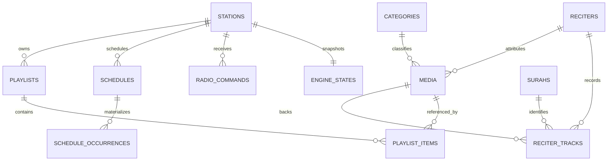
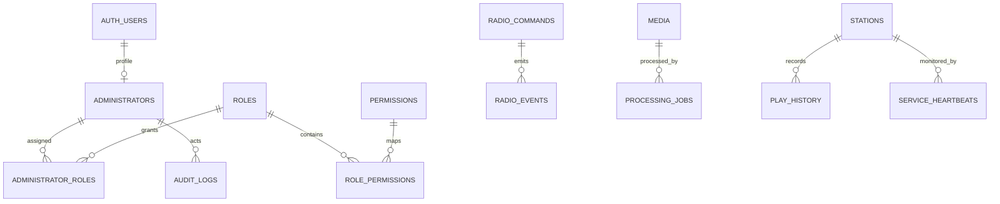
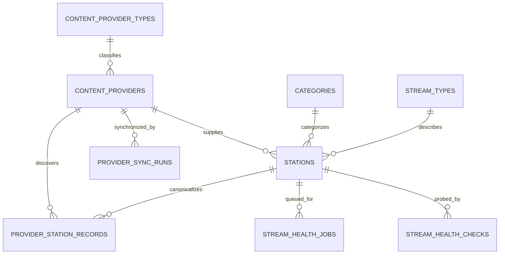

# Database ERD & PostgreSQL Design

> قاعدة بيانات مشروع **ترتيل (Tarteel)**. المعرّف التقني: `tarteel`.

## 1. مبادئ النمذجة

- UUID للكيانات التشغيلية؛ `smallint` للسور الثابتة.
- `timestamptz` لكل لحظة فعلية، و`date` + `time` + IANA timezone لتعريف نية الجدولة المحلية.
- soft delete للمحتوى القابل للأرشفة؛ لا soft delete لسجلات audit/history.
- كل target تشغيلي مرتبط بـ`station_id` حتى في MVP.
- Queue/now-playing عبارة عن projections قابلة لإعادة البناء؛ commands/occurrences/events هي ledger.
- لا يدخل Media إلى schedule/playlist الفعلي إلا إذا كان `READY`؛ يفرض ذلك service validation وtransactional functions، لأن CHECK لا يستطيع قراءة صف أجنبي بأمان.

## 2. ERD







## 3. Aggregate ownership

| Aggregate | الجداول | invariant الأهم |
|---|---|---|
| Identity | administrators/roles/permissions/maps | Auth user فعال + permission backend-side |
| Catalog | media/categories/reciters/surahs/tracks | المحتوى المنشور صالح وغير مؤرشف |
| Station | stations/playlists/items/programs | default playlist تنتمي للمحطة وفعالة |
| External catalog | provider types/providers/stream types/stations/health/sync runs | external records لا تدخل automation؛ لا حذف عند sync failure |
| Scheduling | schedules/templates/occurrences | occurrence unique ولا يُنفذ مرتين |
| Automation | commands/events/state/queue/lease/history | leader واحد وfencing token صالح |
| Operations | heartbeats/logs/audit/metrics | append-only + retention |

### 3.1 Table catalog والعلاقات الحاكمة

| Table | العلاقات الأساسية | Constraints/Indexes الحاكمة |
|---|---|---|
| `administrators` | PK/FK → `auth.users` | active/deleted، لا حذف Auth قبل فك التاريخ |
| `roles`, `permissions` | M:N عبر `role_permissions` | unique code؛ administrator M:N عبر `administrator_roles` |
| `categories` | self parent، station/media children | unique slug، icon key، active/deleted، sort index عند الحاجة |
| `reciters` | media/tracks children | trigram normalized Arabic search، active/deleted |
| `surahs` | parent لـtracks | id=number، 1..114 unique، positive ayah count |
| `media` | category/reciter/admin FKs | READY يتطلب processed path/duration/checksum؛ filter index؛ immutable object keys |
| `processing_profiles` | profile code + version | output codec/rate/loudness/resource limits؛ versioned immutable semantics |
| `processing_error_codes` | code PK | retry taxonomy مركزية |
| `media_processing_jobs` | media + profile FK | SKIP LOCKED claim، lease، fencing token، bounded attempts |
| `media_processing_attempts` | job + media FK | worker/claim history، trusted probe metadata، timings/failures |
| `processed_media_variants` | media/job/attempt/profile FK | immutable Storage object والخصائص المتحققة |
| `reciter_tracks` | reciter+surah+media | unique `(reciter_id,surah_id,quality)`؛ media أو URL لازم |
| `content_provider_types`, `stream_types` | lookup parents | DB-managed codes؛ لا provider names في Flutter logic |
| `content_providers` | parent لـstations/sync/provider records | unique slug، priority/health، rights/attribution/production gate، soft delete |
| `stations` | provider/category/type، default playlist للـINTERNAL فقط | unique slug وprovider/external key، source/type/health/rights/production checks |
| `stream_health_checks` | station FK | append-only، protocol evidence، station/time index |
| `stream_health_jobs` | station/admin requester | idempotency، pending priority index، claim/heartbeat/attempts |
| `provider_sync_runs` | provider FK | counts/status/cursor/error، provider/time index |
| `provider_station_records` | provider+canonical station | unique provider/external key، last seen/missing/raw bounded metadata |
| `playlists` | station parent | unique station/name وstation/id لدعم composite FKs، optimistic version |
| `playlist_items` | playlist+media | unique playlist/position، positive weight، ordered index |
| `programs/items` | station/media | unique positions؛ PROGRAM seam دون UI في MVP |
| `schedules` | station + exactly one target | type/content checks، composite station target FKs، partial due index |
| `schedule_templates/items` | station/template | versioned code، valid date range؛ لا يدمر base schedules |
| `schedule_occurrences` | schedule+station | unique occurrence key، due partial index، claim/status ledger |
| `radio_commands` | station/admin | unique station/idempotency، pending priority index، lifecycle timestamps |
| `queue_entries` | station/media/occurrence/command | persistent business queue، unique station/idempotency، fenced claim |
| `command_effects` | command | unique effect ledger، payload hash، PREPARED/DISPATCHED/ACKED recovery |
| `station_leases` | one row/station | monotonic fencing token، DB-time expiry |
| `engine_states`, `queue_snapshots` | one row/station | revision/token/checksum؛ projections قابلة للمصالحة |
| `now_playing` | one row/station | monotonic revision؛ يكتب بعد playout ACK |
| `radio_events` | station/command/occurrence/media | append-only identity، station/time index |
| `play_history` | station/media/source | append-only، station/start index، command/occurrence correlation |
| `app_config` | key/value | public allowlist flag؛ updates audited |
| `audit_logs` | actor/resource | append-only، resource/time index؛ no secrets |
| `system_logs` | optional station/command/media | structured levels، service/time index، retention |
| `service_heartbeats` | optional station | instance PK، freshness/health details |
| `station_metrics_minute` | station | PK station/time، aggregates بلا raw IP |

الـDDL التنفيذي في [`../supabase/migrations/`](../supabase/migrations/) ومقسّم إلى baseline، service-role access، integrity، وadvisor hardening. لا تعتمد أي خطوة على إنشاء يدوي من Dashboard.

## 4. تصميم الجدولة الزمنية

السجل يحتفظ بـ:

- `start_date`, `end_date`, `start_time`: النية المحلية.
- `timezone`: snapshot IANA عند إنشاء schedule؛ تغيير timezone المحطة لا يعيد تفسير القديم تلقائيًا.
- `next_run_at`: قيمة UTC مشتقة للتسريع وليست مصدر الحقيقة.
- `schedule_occurrences.scheduled_for`: اللحظة UTC المحسوبة.
- `occurrence_key`: hash منطقي من `(schedule_id, local_date, local_time, timezone, fold)`.

سياسة DST: وقت غير موجود بسبب spring-forward ينتقل لأول لحظة صالحة بعد الفجوة ويسجل `DST_SHIFTED`. الوقت المكرر في fall-back يستخدم أول occurrence افتراضيًا (`fold=0`) ولا يتكرر إلا بسياسة صريحة مستقبلًا.

## 5. الفهارس والتقسيم

- due schedules: partial index على `(next_run_at, priority)` حيث enabled وغير محذوف.
- commands: partial index على `(station_id, priority desc, created_at)` حيث `PENDING`.
- media search: `pg_trgm` على normalized Arabic/English fields في migration لاحقة، وB-tree للفلاتر.
- `radio_events`, `play_history`, `system_logs`, metrics مرشحة للتقسيم الشهري عند بلوغ الحجم، وليس قبل القياس.
- جميع foreign keys ذات مسارات الحذف المقصودة: RESTRICT للمحتوى التاريخي، CASCADE لجداول الربط فقط.

## 6. Supabase exposure model

- `app` و`radio` غير مضافين إلى exposed schemas.
- `api` يحوي security-invoker views/RPCs عامة محدودة فقط، أو يخدم REST service قاعدة البيانات مباشرة دون Data API.
- RLS مفعّل defense-in-depth؛ لا grants إلى `anon/authenticated` إلا بشكل صريح.
- `service_role` لا يصل إلى المتصفح مطلقًا؛ API/workers تستخدم أسرار server-side.
- لا تعديل مباشر لجداول `storage`؛ كل object mutation عبر Storage API.
- production station projection يضم provider ويطبق effective rights/health؛ لا يعتمد على `production_enabled` وحده.

## 7. البدائل

- **Enums مقابل lookup tables:** enums مناسبة للحالات الثابتة؛ permissions lookup table لأنها تتوسع. أي enum جديد migration صريح.
- **pg_cron للScheduler:** مرفوض كمحرك playout؛ يصلح housekeeping فقط. scheduler يحتاج state/queue/ACK.
- **Realtime commands:** يمكن استخدامه كـwake-up optimization، لكن polling/claim هو correctness path حتى لا يصبح فقد event سببًا لفقد command.

## 8. Dependencies والمخاطر

- مرجع `auth.users` يجعل الاختبارات المحلية تحتاج Supabase stack أو fixture schema متوافقًا.
- cyclic default playlist FK يضاف بعد إنشاء الجدولين.
- JSONB payloads تحتاج JSON Schema في API؛ قاعدة البيانات تفرض الشكل الأساسي فقط.
- تعديل role قد لا ينعكس فورًا في JWT؛ authorization الحساس يقرأ DB أو يجبر refresh/revoke.

## 9. Acceptance Criteria

- DDL يمر على PostgreSQL/Supabase محلي في المرحلة الثانية دون FK ordering errors.
- كل جدول مطلوب في Master Prompt موجود أو موثق كبديل.
- لا يوجد schedule occurrence بلا مفتاح unique.
- لا يوجد command بلا station/idempotency/audit status.
- ERD يدعم محطة ثانية دون migration بنيوي.
- RLS/grants tests جزء إلزامي من migration phase.
- EXTERNAL station لا يمكنها امتلاك automation rows، وprovider sync لا يحذف canonical station.
- effective provider/station rights تمنع production publication افتراضيًا.

## 10. Phase 2 implementation record

تم تحويل التصميم إلى أربع migrations مرتبة داخل `supabase/migrations/`:

1. `initial_schema`: schemas/types و39 جدولًا وقيود العلاقات وRLS وtriggers الأساسية.
2. `service_role_access`: وصول server-side صريح لـ`service_role` مع إبقاء `anon/authenticated` خارج `app/radio/api`.
3. `station_schedule_integrity`: اتساق INTERNAL/EXTERNAL، URL وIANA timezone، ومنع تكرار أيام الأسبوع.
4. `advisor_hardening`: نقل `pg_trgm` من `public` وفهارس مسارات الاستعلام النامية.

### 10.1 تعديلات minimal عن التصميم المعتمد

- أصبح regex لرموز provider/stream يقبل الأرقام بعد الحرف الأول لدعم `MP3QURAN` و`MP3_STREAM`.
- توسع `reciter_tracks` بـ`provider_id`, `rewaya`, `format`, `bitrate_kbps`, `metadata` وفهرسين unique منفصلين للمصدر الداخلي والخارجي؛ لم يعد القيد يمنع رواية أو مصدرًا إضافيًا.
- أضيف `slug` و`metadata` للقراء، و`description` للفئات، و`old_values/new_values` للـaudit.
- `app_config` يحتفظ بـ`value_type` وCHECK يطابق نوع JSON الأساسي بدل JSON dump غير منضبط.
- قيد مركب `(station_id, default_playlist_id)` يضمن أن Default Playlist تنتمي للمحطة نفسها.

### 10.2 Extensions

- `pgcrypto`: `gen_random_uuid()`.
- `pg_trgm`: بحث تقريبي عربي/إنجليزي مبدئي؛ نُقل إلى schema `extensions` بدل `public`.

لا توجد extensions إضافية خاصة بالمشروع.

### 10.3 RLS and grants

- RLS مفعّل على كل الجداول الـ39 في `app` و`radio`.
- عدد policies حاليًا `0` عمدًا: عدم وجود policy مع RLS يعني default-deny، كما أن schema usage مسحوب من `anon` و`authenticated`.
- `service_role` وحده يملك grants server-side اللازمة، ولا يجوز استخدام مفتاحه في العميل.
- Public read projections/policies مؤجلة إلى API Phase لأن Flutter لا يقرأ الجداول الداخلية مباشرة.

### 10.4 Seed strategy and verified counts

`supabase/config.toml` يشغّل `supabase/seed/*.sql` معجميًا. إعادة التشغيل اختبرت ولم تغيّر الأعداد:

| Seed | العدد الفعلي |
|---|---:|
| Roles | 4 |
| Permissions | 34 |
| Role-permission mappings | 70 |
| Categories | 13 |
| Surahs | 114؛ الأرقام 1..114؛ مجموع العد الكوفي 6236 |
| Providers | 6 records / 5 provider types |
| External stations | 58 |
| Provider station mappings | 58 |
| App config keys | 13 |

### 10.5 System logs scope

`system_logs` ليس منصة logs عالية الحجم. يستخدم فقط للأحداث التشغيلية المهمة مع retention محدود؛ stdout/structured logs والmetrics تنتقل لاحقًا إلى منصة observability. `radio_events`, `play_history`, و`stream_health_checks` مرشحة للتقسيم بعد قياس الحجم.

### 10.6 Migration and reset workflow

```bash
supabase start
supabase db reset
supabase test db
```

في هذه البيئة لم يكن Supabase CLI/Docker متاحًا. بدأ المشروع البعيد بقاعدة مشروع خالية من جداول `app/radio/api` ومن migrations؛ طُبقت migrations الأربع بالترتيب، ثم seeds، ثم أعيد تشغيل seeds واختبارات validation. كذلك اجتاز baseline + جميع seeds dry-run داخل transaction قبل أول تطبيق. لا توجد Dashboard steps مخفية.

### 10.7 Type generation

بعد تثبيت Supabase CLI وتشغيل migrations، استخدم:

```bash
PROJECT_REF=<project-ref> ./scripts/generate-db-types.sh
```

لا يُحفظ access token أو secret key في المستودع. Flutter سيستهلك API contracts لاحقًا، لا database types الداخلية.

### 10.8 Backup considerations

المخطط قابل لإعادة البناء من migrations + seeds، لكن هذا لا يستبدل backup للبيانات التشغيلية و`auth.users`. قبل production: PITR/backup policy، نسخ Storage، واختبار restore إلى staging مع فحوص 114 سورة وFKs وحقوق المصادر.

## 11. Storage Phase additions

Phase 3 أضافت `UPLOADED` إلى `media_status`، وربط storage metadata إلى `media`، وجدولي `storage_upload_formats` و`media_upload_intents`. بقيت Database مصدر lifecycle، و`storage.objects` metadata read-only؛ كل mutation فعلية تتم عبر Storage API. التفاصيل في [`STORAGE.md`](./STORAGE.md).
