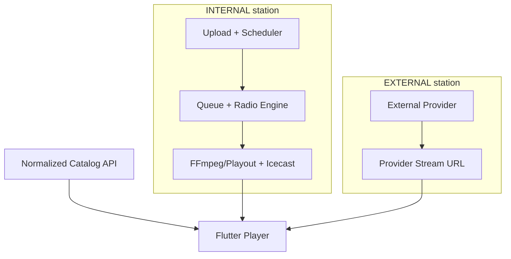

# External Quran & Islamic Radio Sources

> هذا الكتالوج جزء من **ترتيل (Tarteel)**، مع بقاء كل مصدر خارجي غير معتمد للإنتاج افتراضيًا.

## 1. Architectural boundary



المساران يشتركان فقط في `stations` catalog/public API/favorites/search. External streams لا تدخل Scheduler أو Queue أو Radio Engine، ولا تمر عبر proxy افتراضيًا. Provider outage لا يملك dependency edge إلى Internal playout.

Proxy غير افتراضي، ولا يعتمد إلا بعد ADR يثبت سببًا قانونيًا/تقنيًا، rights approval، capacity/egress، privacy، caching، transcoding، ومراقبة جديدة. تغيير proxy policy لا يغير Flutter station ID.

## 2. Data model

### Provider-managed lookups

- `content_provider_types`: `INTERNAL`, `QURANGO`, `MP3QURAN`, `CUSTOM`, `OTHER` كبيانات seed، لا switch hard-coded في Flutter.
- `stream_types`: `INTERNAL`, `HLS`, `ICECAST`, `SHOUTCAST`, `MP3_STREAM`, `AAC_STREAM`, `UNKNOWN_STREAM`.
- Adapter registry في Backend يربط provider type بimplementation عند sync؛ provider/catalog names تظل DB-managed.

### Tables

- `content_providers`: URLs/config/priority/health/rights/attribution/metadata.
- `stations`: `provider_id`, `station_source`, `stream_type`, category, primary/fallback, health counters, external key/last seen, rights، production gate.
- `stream_health_checks`: append-only result لكل probe.
- `stream_health_jobs`: periodic/forced checks مع idempotency/claim/heartbeat/retry.
- `provider_sync_runs`: fetch/insert/update/missing/invalid counts وcursor/error.
- `provider_station_records`: provider external key/raw discovery ↔ canonical internal station. يسمح بأكثر من Provider يشير لنفس stream دون تكرار favorite/catalog ID.
- categories مرنة مع `icon_key`، ولا enum داخل Flutter.

DB trigger يمنع playlists/programs/schedules/radio commands لمحطة EXTERNAL. Public production query يطلب **معًا**: station/provider active، provider/station production_enabled، effective rights approved، commercial policy allowed، وحالة health ضمن السياسة.

`station_source` immutable. التحويل INTERNAL↔EXTERNAL ينشئ station record جديدًا بدل تغيير هوية record له history/favorites/automation semantics مختلفة.

## 3. Provider Adapter architecture

```text
interface RadioProviderAdapter {
  fetchStations(cursor?): ProviderPage
  normalizeStation(raw): NormalizedStation | ValidationError
  validateStream(station): StreamProbeResult
  syncStations(page, run): SyncSummary
  mapCategories(raw): InternalCategory
  healthCheck(station): StreamProbeResult
}
```

- `Mp3QuranProviderAdapter`: v3 API أولًا، legacy JSON fallback للاكتشاف فقط، response schema محصور داخل adapter.
- `QurangoProviderAdapter`: static curated seed + optional discovery feed إن توفر؛ لا screen scraping ضمن correctness path.
- `CustomProviderAdapter`: records يضيفها Admin، بلا remote catalog sync.
- `InternalProviderAdapter`: لا fetch خارجي؛ يجمع health من Icecast/Engine.

Adapters تعيد DTO موحدًا، ولا تكتب DB مباشرة؛ `ProviderSyncService` ينفذ transaction/compare/audit. Flutter لا يرى raw payload أو provider external IDs إلا attribution field عام عند الحاجة.

## 4. Sync algorithm

```text
create provider_sync_run(PENDING)
claim one run per provider
fetch with timeout/retry/response size/schema limits
normalize names/category/type/url/external_key
validate and deduplicate within batch
compare by (provider_id, external_key) in provider_station_records
match exact normalized URL/canonical mapping; never fuzzy-merge automatically
insert new canonical station only when no safe match; REVIEW_REQUIRED + production_enabled=false
update provider-owned fields only; preserve admin overrides
set last_seen_at for seen rows
mark missing_count; never delete/disable on one missing run
enqueue bounded health checks
complete/partial/fail run with metrics
```

حقول كل station تقسم منطقيًا إلى:

- provider-owned: external_key، discovered name/url/raw metadata/last_seen.
- admin-owned: category override، featured، enabled، fallback، rights، production gate، internal notes.

Missing policy: لا حذف. بعد N successful sync runs ومدة غياب configurable تصبح `DEGRADED/NOT_SEEN` للمراجعة؛ لا تتغير records عند provider fetch failure. Sync locks per provider/idempotency run تمنع jobين متوازيين.

إذا أعاد MP3Quran رابط Qurango موجودًا، ينشأ provider record جديد مرتبط بالمحطة canonical نفسها عند exact safe match. تشابه الاسم وحده يولد review candidate ولا يدمج تلقائيًا.

## 5. Stream health checks

لا يكفي HTTP 200. Probe محدود الموارد ومقاوم SSRF:

1. resolve DNS مع منع private/link-local/metadata IPs، والتحقق مجددًا بعد redirect.
2. TLS/HTTP connect، redirect count/domain policy، latency/status/content type.
3. للـICY/MP3/AAC: قراءة bytes لزمن/حجم bounded، sniff headers، decode frames قصيرة بـFFprobe/decoder sandbox، إثبات audio frames.
4. للـHLS: parse master، اختيار variant، parse media playlist، fetch segment bounded، verify codecs/audio track وplaylist freshness.
5. لا يخزن redirect token/signed URL في logs؛ metadata sanitized.

### State policy الأولية

| الحالة | الشرط |
|---|---|
| UNKNOWN | لم يفحص أو evidence غير كافٍ |
| HEALTHY | نجاح probe فعلي؛ recovery بعد نجاحين متتاليين |
| DEGRADED | فشلان متتاليان، latency مرتفع، stale HLS، أو fallback active |
| UNREACHABLE | 5 failures متتالية أو connect/DNS timeout متكرر |
| INVALID | URL/SSRF/unsupported format/schema أو لا audio بعد فحص حاسم |

أول فشل يسجل ولا يعطل. thresholds/timeouts config، وjitter يمنع thundering herd. عند failure يشغّل Flutter fallback فقط بعد bounded retry؛ لا failback للـprimary حتى stability window. Public API يمكن إخفاء UNREACHABLE/INVALID حسب config، ولا يحذف record. `force health check` admin ينشئ job audit ولا ينفذ probe داخل HTTP request.

## 6. Technical observations on initial inventory

- عينات Qurango أعادت `audio/mpeg` وICY/Shoutcast headers؛ seed يصنفها `SHOUTCAST`، لكن health worker يعيد الاكتشاف ولا يثق بالseed.
- HLS sample هو master playlist يحتوي H.264 video وAAC audio؛ يسجل `contains_video=true`. Flutter يعرضه كـradio audio session فقط بعد device tests وعدم إظهار video UI.
- Radiojar sample أعاد redirect ديناميكيًا؛ seed يبقى `UNKNOWN_STREAM` حتى probe decoder ناجح. لا يخزن redirect النهائي الموقّت.
- MP3Quran v3 يعيد `{radios:[{id,name,url,...}]}` بينما legacy يستخدم casing/shape مختلفًا؛ هذا يثبت ضرورة adapter وعدم ربط Domain model بأحد الشكلين.

هذه observations بتاريخ مراجعة التصميم وليست health guarantee مستمرة.

## 7. Public API and Flutter model

`GET /api/v1/stations` يعيد catalog موحدًا، ويدعم `source`, `provider`, `category`, `stream_type`, `health`, `featured`, `q`, pagination. Flutter model:

```json
{
  "id": "internal-uuid",
  "name_ar": "إذاعة ماهر المعيقلي",
  "name_en": "Maher Al-Muaiqly",
  "category": {"code":"RECITER","name_ar":"القراء"},
  "station_source": "EXTERNAL",
  "stream_type": "SHOUTCAST",
  "playback": {"primary_url":"https://...","fallback_url":null},
  "health": "HEALTHY",
  "is_live": true,
  "is_featured": false,
  "attribution": null
}
```

`playback` abstraction يسمح مستقبلاً بإخفاء URL أو proxy بلا تغيير Domain model. Favorites تحفظ `station.id` فقط. Player factory يختار source configuration حسب stream_type؛ HLS له Android/iOS test matrix مستقل، بينما UI لا يعرف provider adapter.

Search index موحد للأسماء العربية/الإنجليزية/category/provider aliases مع normalization المعتمد؛ روابط URLs لا تدخل search UI.

## 8. Admin model

قسم External Stations: station/provider/category/type/health/last check/last success/latency/enabled/featured/rights/production. Actions: add/edit/enable/disable/test/change provider/fallback/force check/history/rights review.

Automation buttons `Play Now`, `Schedule`, `Upload to Station` تظهر فقط لـINTERNAL، والـAdmin API يرفضها لـEXTERNAL حتى لو تم تزوير UI request.

Provider management يعرض sync status، last success، discovered/missing/invalid counts، API endpoint configuration (secret values masked)، attribution/terms/rights.

## 9. Rights and production gating

القائمة Technical Source Inventory وليست إثبات حقوق. القيم default:

- provider/station `rights_status=REVIEW_REQUIRED`
- `commercial_use_status=UNKNOWN`
- `production_enabled=false`
- attribution/source/terms محفوظة للمراجعة

`RESTRICTED` أو `DISABLED` لا يظهر في production مهما كانت health. Approval يحتاج actor/date/evidence/internal notes وAudit. تغيير provider إلى restricted يعطل effective publication لكل محطاته حتى لو station flag قديم.

## 10. Seed strategy

- `supabase/seed/providers.sql`
- `supabase/seed/categories.sql`
- `supabase/seed/external_stations.sql`

Seeds تستخدم natural unique slugs و`ON CONFLICT DO NOTHING` حتى لا تمحو admin edits. Inventory الحالي: 58 station records، كلها EXTERNAL/UNKNOWN health/not production-enabled. MP3Quran sync قد يكتشف أكثر؛ لا تعتبر seed قائمة نهائية.

## 11. Failure isolation

- Provider API/Qurango outage يؤثر sync/health/external catalog فقط.
- external health worker له pool/DB connection budget منفصل عن Radio Engine.
- لا writes إلى `radio.*` من adapters.
- Internal station لا يستخدم external URL كـNever Silence fallback.
- bulk external failure يطبق rate-limited updates/alerts ولا يملأ system logs أو DB pool.

## 12. Acceptance Criteria

- Provider/Station/URL/category تتغير بلا Flutter release.
- MP3Quran shape change محصور في adapter.
- missing provider records لا تحذف، وfailed sync لا يغير last_seen.
- probe يميز HTTP success بلا audio وHLS stale/invalid.
- fallback/recovery policy لها tests، والـrecord لا يحذف.
- Favorites تستخدم internal UUID، والبحث موحد.
- production يمنع effective rights غير approved.
- External station لا تقبل schedule/command حتى عبر API/DB.
- سقوط كل external providers لا يؤثر في Internal Engine/Icecast acceptance test.

## 13. Technical references reviewed

- [MP3Quran v3 radios API](https://www.mp3quran.net/api/v3/radios?language=ar)
- [MP3Quran legacy radio JSON](https://www.mp3quran.net/api/radio/radio_ar.json)
- [just_audio package](https://pub.dev/packages/just_audio)
- [Android Media3 HLS](https://developer.android.com/media/media3/exoplayer/hls)
- [Apple AVFoundation HLS playback](https://developer.apple.com/documentation/avfoundation/using-avfoundation-to-play-and-persist-http-live-streams)

Stream URLs نفسها موجودة في seed inventory. الوصول التقني وقت المراجعة لا يثبت الاستمرارية أو الحقوق.
