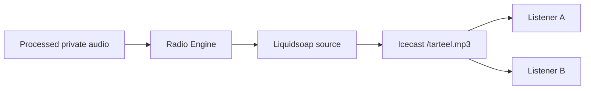

# Icecast Development Architecture

## Purpose and boundary

Icecast is the distribution server for the single managed Tarteel source. It accepts one continuously encoded source and fans the same current bytes out to every listener. It does not select media, schedule content, or own Now Playing state. External stations never pass through this mount.



## Development configuration

| Item | Decision |
|---|---|
| Version tested for config parsing | Icecast 2.4.4 |
| Fixed mount | `/tarteel.mp3` |
| Listen address | `0.0.0.0:8000` inside container; development compose publishes `127.0.0.1:8000` only |
| Source format | MP3, `audio/mpeg`, 128 kbps, 44.1 kHz, stereo |
| Source clients | One fenced Radio Engine owner per station |
| Admin surface | Not published separately; credentials required and supplied only through environment |
| Logs | Container stdout/stderr or mounted logging driver; passwords never logged |

Files are under `infrastructure/icecast/`. `icecast.xml.template` contains placeholders, not credentials. `render-config.mjs` rejects missing/placeholder values and writes a runtime-only config. The container drops Icecast to `nobody:nogroup`, uses a read-only filesystem, tmpfs for temporary/config/log data, and `no-new-privileges`.

## Secrets

Copy `.env.example` to an ignored `.env` for local use. Source, relay, and admin passwords must be independently generated. Production secrets belong in the deployment secret manager. Never expose the source/admin ports or passwords to Flutter or browsers.

## Development startup

```bash
cd infrastructure
cp icecast/.env.example icecast/.env
# replace every placeholder
docker compose -f docker-compose.radio.yml up --build icecast
curl http://127.0.0.1:8000/status-json.xsl
```

Docker was unavailable in the Work execution environment. The Docker image and config renderer were validated statically, and Icecast 2.4.4 parsed the generated configuration. A real Icecast source/listener run remains mandatory on a normal Docker or non-root Linux host because this sandbox executes as UID 0 and blocks the `setuid/setgroups` operation Icecast requires.

## Health semantics

- Icecast process health: `/status-json.xsl` responds.
- Mount health: `/tarteel.mp3` exists and returns decodable `audio/mpeg` bytes.
- Station readiness: engine owns the current lease, the source reports connected, and the mount probe decodes audio.

HTTP 200 alone is not a streaming acceptance test. The Phase 5 closure test must use at least two independent decoders joining at different times.

## Recovery

Liquidsoap owns reconnection to Icecast with bounded connection timeouts. The Radio Engine observes source connect/disconnect callbacks, enters `RECOVERING`, checkpoints the fault, and restarts the source process only when it exits. Container supervision restarts Icecast. Reconnect uses bounded backoff; production must add a restart budget and alerting before exposing the mount.

## Production hardening deferred

- TLS termination and public hostname at Nginx.
- Separate internal network for source/admin traffic.
- Pinned image digest and vulnerability scanning.
- Standby Icecast/failover topology and a measured client reconnect policy.
- Listener limits, rate limits, log shipping, capacity and soak testing.

