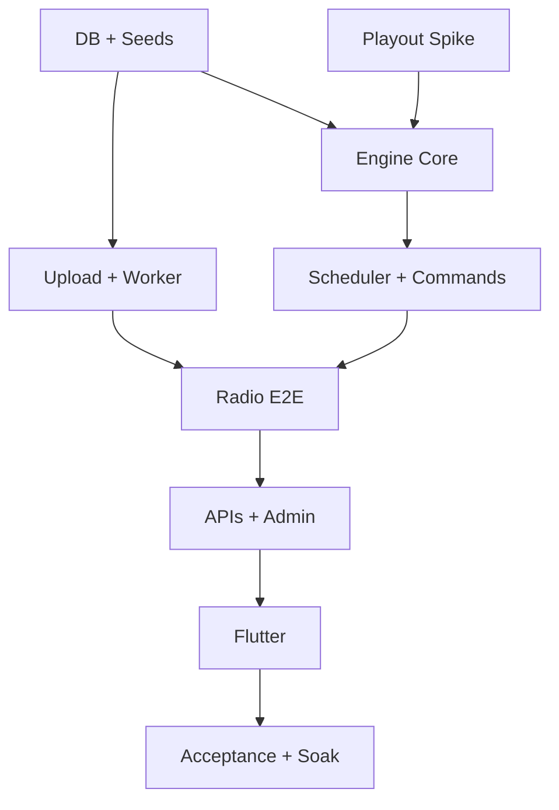

# MVP Backlog & Implementation Plan

> خطة MVP لمنصة **ترتيل (Tarteel)** (`tarteel`).

## 1. Definition of Done لكل خطوة

`Plan → Implement → Test → Verify → Document → Commit-ready`. لا تنتقل الخطوة إذا فشل مسارها الأساسي. لا تُقبل mock لخدمات DB/FFmpeg/Icecast/Engine في integration path؛ يمكن fakes فقط في unit tests للـpure logic.

## 2. مراحل التنفيذ الصغيرة المرتبة

### Gate 0 — اعتماد Technical Design (هذه المرحلة)

- اعتماد القرارات المفتوحة في README.
- مراجعة DDL/ERD/state/algorithms/security/topology.
- تسجيل القرارات كـADRs.
- **قبول:** checklist آخر هذا الملف مكتملة؛ لا runtime code.

### 1 — Repository & Local Toolchain

- تثبيت Node/Flutter/Supabase CLI/FFmpeg/Icecast/container versions.
- workspace/package manager، lint/format/test skeleton، env examples بلا secrets.
- CI أولي وdocs commands.
- **اختبار مستقل:** clean clone يشغل checks وSupabase local.

### 2 — Database Migrations & Seeds

- تحويل proposed DDL إلى migrations صغيرة مرتبة.
- roles/permissions seed، 114 surahs verified seed، محطة development واحدة.
- grants/RLS، constraints، indexes، updated_at، database tests.
- **اختبار:** migrate from zero + reset + seed count=114 + forbidden access tests + advisors clean.

### 3 — Storage & Upload Intent

- **مطبق في Phase 3:** ثلاث buckets، upload intent/complete، MIME/extension/size guard، immutable key، orphan candidates.
- Media lifecycle أصبح `UPLOADING → UPLOADED`؛ `PROCESSING` يبدأ في Audio Worker فقط.
- **النتيجة:** 16/16 DB tests وHTTP anonymous denial؛ authorized binary upload يحتاج Backend Storage runtime.

### 4 — Audio Processing Worker

- claim/heartbeat/recovery، ffprobe validation، two-pass normalization، encode/verify/store.
- READY/FAILED transitions وprocessing metrics.
- **اختبار حقيقي:** MP3/AAC/M4A/WAV fixtures → verified output؛ corrupt file fails safely.

### 5 — Icecast + Continuous Playout Spike

- **مطبق جزئيًا في Phase 5:** تم اختيار Liquidsoap، إنشاء fixed mount/config/metadata وقياس continuous source/recovery بمستمعين عبر proof relay.
- **Gate متبقٍ:** تشغيل نفس الاختبار على Icecast حقيقي في Docker/non-root host؛ Work sandbox منع privilege drop.
- **اختبار:** 6h loop، 500 track switches، forced decoder/source crash، هاتفان/clients في اللحظة نفسها.
- **Gate:** Liquidsoap معتمد تقنيًا؛ لا تبدأ Scheduler قبل إغلاق Icecast E2E الحقيقي.

### 6 — Radio Domain Core

- pure state machine، candidate model، priority arbiter، queue lanes، deterministic shuffle.
- property/unit tests لكل transitions/ties.
- **اختبار:** كل سيناريوهات Radio Engine المذكورة في Master Prompt دون I/O.

### 7 — Leader Lease & Checkpoints

- per-station lease/fencing، engine/queue snapshots، local emergency cache.
- **اختبار:** workerان يتنافسان؛ واحد فقط يصدر effects؛ network partition يرفض token القديم.

### 8 — Scheduler

- occurrence materialization، one-time/daily/weekly، DST، preview، edit/version، conflicts.
- **اختبار:** timezone matrix + restart + midnight + duplicate ticks + 1000 definitions.

### 9 — Commands & Queue Integration

- PLAY_NOW/PLAY_NEXT/SKIP/STOP_AFTER_CURRENT/RESUME_AUTO؛ claim/reconcile/audit.
- **اختبار:** retry/crash at every boundary لا يكرر effect؛ policies الثلاث صحيحة.

### 10 — End-to-End Radio Engine

- Engine ↔ playout ↔ Icecast، Now Playing ACK، history، default/emergency recovery.
- **اختبار:** upload→process→playlist→default→schedule→commands→listen الحقيقي.

### 11 — Watchdog & Observability

- structured logs/metrics/dashboards/alerts، process/external audio probes، restart budget.
- **اختبار:** kill Engine/decoder/encoder/Icecast، DB outage، disk threshold؛ تحقق resume/alert/no storm.

### 12 — Public & Admin REST API

- OpenAPI 3.1، public catalogs/now/config، admin CRUD/commands/health، RBAC/idempotency/cache.
- **اختبار:** contract/security/rate-limit/pagination/stale-cache tests.

### 12A — External Provider Catalog

- provider/type/schema/seeds، adapters، safe sync، protocol-aware health، rights gate، unified catalog.
- **اختبار:** MP3Quran schema fixtures، Qurango/HLS/redirect probes، SSRF، missing-without-delete، provider outage isolation.

### 13 — Admin Panel

- auth، dashboard، media، playlist، schedule day/week/list+forms، commands، health.
- accessible forms وعدم الاعتماد على drag/drop.
- **اختبار:** critical browser E2E من mobile/tablet/desktop viewports.

### 14 — Flutter Core (بعد استقرار backend فقط)

- feature architecture، networking/cache، live background service، on-demand session، favorites/search/settings.
- **اختبار:** Android/iOS background/lock-screen/headphones/focus/retry/fallback/sleep timer؛ no seek live.

### 15 — Acceptance, Staging & Reliability

- Master 22-step acceptance scenario، load/API/listeners، 72h soak، backup restore، security review، rollback drill.
- **قبول:** لا silent gap يتجاوز الهدف، no duplicate command، recovery meets RTO، runbooks proven.

### 16 — Production Preparation

- domains/TLS/secrets/HA choice/capacity/alerts/on-call/store privacy artifacts.
- production readiness review؛ لا deploy قبل sign-off.

## 3. Task Specifications

كل صف Task commit/PR مستقل قدر الإمكان. “الملفات” مسارات مستهدفة تُنشأ عند تنفيذ Task، وليست ملفات منشأة في هذه المرحلة.

| ID | الهدف | Dependencies | الملفات/الخدمات المتأثرة | Acceptance Criteria | الاختبارات المطلوبة |
|---|---|---|---|---|---|
| T01 | تثبيت toolchain وworkspace بلا business code | Gate 0 | root configs، `.github/workflows`، `docs/DEVELOPMENT.md` | clean clone يشغّل lint/test commands؛ versions pinned؛ لا secrets | CI smoke، secret scan، clean-install |
| T02 | تشغيل Supabase محلي وإعداد migration harness | T01 | `supabase/config.toml`, migrations/tests | local start/reset deterministic؛ scripts موثقة | reset مرتين، migration list، CLI version check |
| T03 | إنشاء schemas/types/core RBAC tables | T02 | migrations: app/radio/api، administrators/roles/permissions | FK/check/RLS مفعلة؛ no anon grants | pgTAP/SQL constraints، forbidden anon access، advisors |
| T04 | إنشاء catalog/media/station schema | T03 | media/categories/reciters/surahs/tracks/stations/playlists | cross-station invariants؛ READY constraint؛ soft delete policy | FK/unique/index tests، invalid state tests |
| T05 | إنشاء scheduling/automation schema | T04 | schedules/templates/occurrences/commands/state/events/history | occurrence/idempotency unique؛ composite station FKs | duplicate/concurrency SQL tests |
| T06 | Seed RBAC و114 سورة ومحطة dev | T03–T05 | `supabase/seed/*` | 114 صفًا صحيحًا؛ seed idempotent؛ default roles كاملة | count/checksum، rerun seed، permissions matrix |
| T07 | Storage buckets/policies/upload intent — **implemented with documented binary-upload warning** | T03–T06 | Storage config، SQL lifecycle، API types | originals/private؛ immutable keys؛ complete idempotent؛ spoof prefilter | 16 DB tests، HTTP anonymous denial؛ Backend binary E2E deferred |
| T08 | Audio worker claim/validate | T07 | `services/audio-worker` | heartbeat/stale recovery؛ ffprobe sandbox؛ deterministic failure | valid/corrupt/polyglot/timeout fixtures، duplicate claim |
| T09 | Normalize/encode/store/READY | T08 | worker FFmpeg profiles، media jobs | two-pass profile versioned؛ verified output قبل READY | MP3/AAC/M4A/WAV، loudness/duration/codec، retry/OOM |
| T10 | Icecast/Nginx local environment | T01 | `infrastructure/icecast`, `nginx`, compose | ثابت mount؛ source/admin private؛ listener HTTPS config | source connect، two listeners same timeline، auth/port tests |
| T11 | Playout technology spike | T09–T10 | `services/playout-adapter`, reliability fixtures | اختيار موثق Liquidsoap/FFmpeg؛ 500 switches؛ gap target مقاس | waveform، forced decoder/source crash، 6h soak |
| T12 | Pure Radio Engine state/priority/queue | T05، T11 decision | `services/radio-engine/domain` | كل state/transition؛ total order؛ deterministic shuffle | unit/property/permutation/state coverage |
| T13 | Lease/fencing/checkpoints/emergency cache | T12 | engine runtime، DB automation tables، local volume | leader واحد؛ old token مرفوض؛ recovery snapshot صالح | two-worker split brain، DB partition، corrupt snapshot/cache |
| T14 | Timezone-aware Scheduler | T05، T12–T13 | scheduler module، occurrence tables، preview library | ONE_TIME/DAILY/WEEKLY؛ DST/missed/restart/disable deterministic | 20+ zones، leap/midnight، duplicate tick، 1000 schedules |
| T15 | Radio Commands lifecycle | T12–T14 | Admin API command endpoints، engine claim/reconcile | جميع statuses/commands؛ retry لا يكرر effect؛ audit | crash at boundaries، idempotency، cancel/no-op/permissions |
| T16 | Playout integration وNow Playing | T09–T15 | engine↔adapter↔Icecast، now_playing/history | update بعد ACK؛ default/fallback؛ resume automation | E2E real audio، missing/corrupt media، metadata revision |
| T17 | Watchdog/metrics/logging/audit | T16 | watchdog/collector/monitoring configs | external audio probe؛ bounded restart؛ redacted structured logs | kill/OOM/disk/DB/Storage/Icecast faults، secret scan |
| T18 | Public REST API/OpenAPI | T04–T06، T16 | `services/api`, `packages/api-types` | جميع public endpoints/version/error/page/cache؛ no internals | contract، pagination، cache، rate limit، security |
| T19 | Admin REST API/RBAC | T03–T07، T14–T17 | protected Admin API | backend permission لكل action؛ optimistic concurrency | role matrix، IDOR/BOLA، CSRF/session، stale role |
| T19A | External provider/station schema + seeds | T04–T06 | provider/type/station health/sync migrations، `supabase/seed` | 58 inventory rows idempotent؛ all review-required/not production؛ EXTERNAL automation rejected | seed rerun/count، FK/rights gate، trigger/production projection tests |
| T19B | Provider adapter SDK + MP3Quran/Qurango/Custom | T19A | `services/provider-sync`, domain adapter contracts | raw schemas محصورة؛ normalize/compare؛ missing لا يحذف؛ admin overrides محفوظة | v3/legacy fixtures، schema drift، failed/partial sync، concurrency |
| T19C | Protocol-aware stream health worker | T19A–T19B | `services/stream-health-worker` | MP3/AAC/ICY/HLS probe؛ state thresholds/recovery؛ fallback evidence | SSRF/DNS rebinding، redirect، HTTP-200-no-audio، stale HLS، timeout/load |
| T19D | External Public/Admin API + rights workflow | T18–T19C | API/OpenAPI/admin permissions | unified catalog، health history/actions، rights deny-by-default، no raw provider data | contract/RBAC/IDOR/cache invalidation/effective-rights tests |
| T20 | Next.js Admin UI | T19 | `apps/admin` | الوظائف MVP responsive/accessibility؛ لا direct DB/FFmpeg | browser E2E desktop/tablet/mobile، a11y |
| T20A | External Stations Admin section | T19D، T20 | `apps/admin` external/provider/health/rights screens | add/edit/test/fallback/sync/history/rights؛ no automation buttons | browser E2E، a11y، permission/action visibility |
| T21 | Flutter data/audio foundation | T18، T19D، stable T16 | `apps/mobile`, api client/audio service | cache-first، live/on-demand/internal/external sessions منفصلة، background controls | Dart unit/widget، Android/iOS device audio tests |
| T21A | Unified directory/favorites/search/external playback | T21 | Flutter station model/player factory/catalog | IDs لا URLs للمفضلة؛ provider-agnostic؛ stream_type routing؛ no hard-coded inventory | Android/iOS MP3/ICY/AAC/HLS matrix، URL change، disable/cache refresh، provider outage |
| T22 | Flutter MVP features | T21 | radio/catalog/search/favorites/settings/player | search AR/EN، favorites local، sleep timer، themes، no live seek | widget/integration/offline/retry/fallback tests |
| T23 | Master acceptance + staging | T17–T22 | `tests/acceptance`, staging infra/runbooks | سيناريو 22 خطوة + 14 external criteria؛ provider outage isolation؛ backup/rollback؛ 72h soak | E2E، load، chaos، rights/SSRF/security، restore drill |
| T24 | Production readiness | T23 + approvals | production infra/config/docs | DNS/TLS/secrets/HA/capacity/on-call/privacy approved | readiness checklist، failover، certificate/alert tests |

## 4. Dependencies الحرجة

## 5. Acceptance Criteria للمرحلة الأولى

- [x] تحليل live/on-demand/admin ومتطلبات الجودة والنطاق.
- [x] معمارية نهائية ومسؤوليات وحدود اتساق.
- [x] ERD وDDL مرجعي متعدد المحطات.
- [x] State Machine وانتقالات/recovery/checkpoint.
- [x] Scheduler timezone-aware وoccurrence idempotency.
- [x] Queue/priority/conflict/commands محددة deterministic.
- [x] Never Silence/fallback متعدد الطبقات.
- [x] Storage/FFmpeg/Icecast وتصميم فصل on-demand.
- [x] Public/Admin API contract.
- [x] Auth/RBAC/RLS/security model.
- [x] Monitoring/watchdog/backup/deployment/monorepo.
- [x] مراجعة race/SPOF/timezone/gaps/duplication/scaling.
- [x] فصل INTERNAL/EXTERNAL، provider adapters/sync/health/rights، و58-row seed inventory.
- [ ] اعتماد المالك للقرارات المفتوحة.
- [ ] اعتماد Acceptance targets: gap/SLO/RPO/RTO/retention.

## 6. Checklist الانتقال إلى المرحلة الثانية

- [ ] اختيار playout adapter: Liquidsoap أو custom persistent FFmpeg.
- [ ] تحديد timezone وregion للمحطة الأولى.
- [ ] اعتماد audio profile بعد listening samples أو السماح بSpike يقارن profiles.
- [ ] اعتماد storage provider للـMVP وسياسة backup/egress.
- [ ] اعتماد production topology: single-host risk مؤقتًا أو dual Icecast.
- [ ] اعتماد default interrupt policy وlate grace.
- [ ] اعتماد data retention وprivacy notice scope.
- [ ] اعتماد Rights Review workflow ومن يملك صلاحية `APPROVED`/`production_enabled`.
- [ ] اعتماد health thresholds وسياسة إخفاء `UNREACHABLE` من Public API.
- [ ] تثبيت ADRs من القرارات السابقة.
- [ ] مراجعة اسم المنتج/domains placeholders؛ لا يلزم DNS الآن.
- [ ] تصريح صريح: **ابدأ المرحلة الثانية — Repository & Database Foundation**.

بعد اكتمال القائمة تكون أول نتيجة للمرحلة الثانية: repo tooling + migrations/seeds محلية قابلة لإعادة الإنشاء. لا تبدأ Upload/FFmpeg قبل نجاح database reset/security tests.
