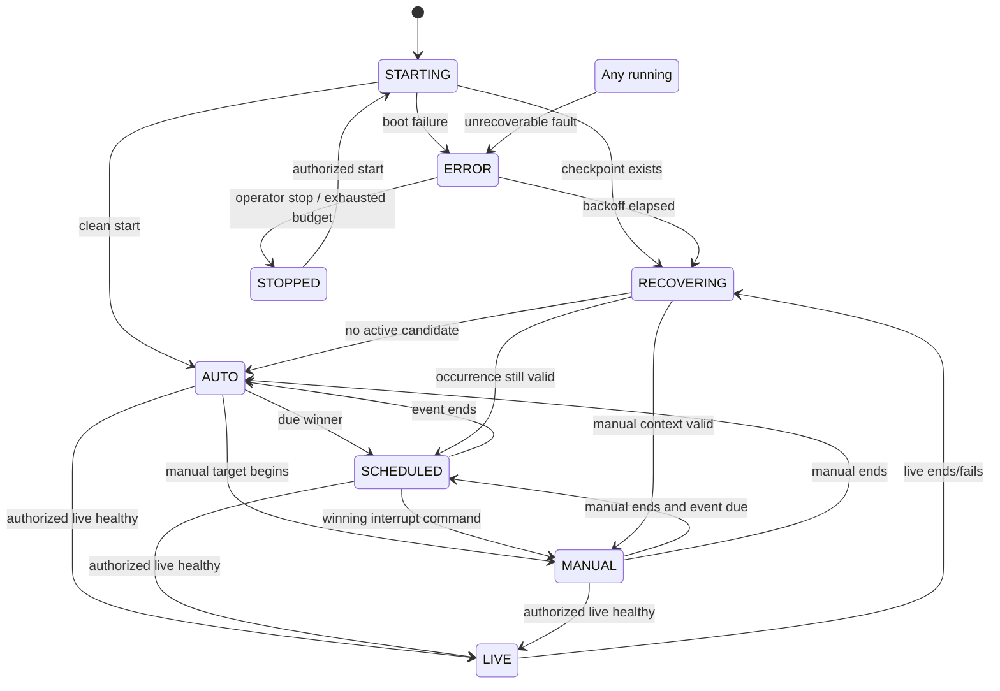
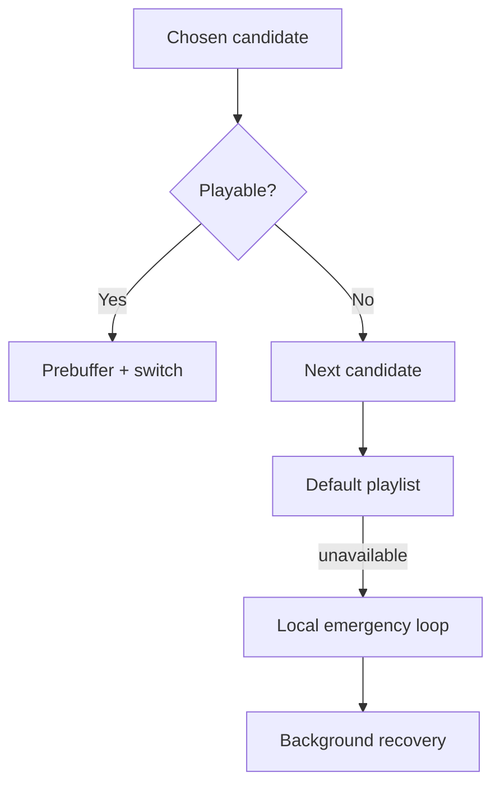

# Radio Engine, Queue Manager & Radio Commands

تفاصيل حساب occurrences والـDST والـmissed schedules موجودة في [`SCHEDULER.md`](./SCHEDULER.md). هذه الوثيقة تبقى المرجع لقرارات الحالة والـQueue والتنفيذ الصوتي.

> **Boundary:** هذه الحالة والـQueue والـCommands تنطبق على `station_source=INTERNAL` فقط. EXTERNAL station لا تملك Engine state/lease/schedule/playlist/command، ويمنعها API وDB triggers. انظر [`EXTERNAL_STATIONS.md`](./EXTERNAL_STATIONS.md).

> **Phase 6:** الانتقالات AUTO/SCHEDULED/MANUAL أصبحت منفذة، وLiquidsoap يبقى متصلًا بالم mount الثابت أثناء تغيير القرار. التحكم runtime عبر loopback-only command socket؛ `request.queue` يستقبل القرار التالي و`main.skip`/`automation.skip` يطبقان INTERRUPT على المصدر النشط فقط. راجع [`QUEUE_MANAGER.md`](./QUEUE_MANAGER.md) و[`RADIO_COMMANDS.md`](./RADIO_COMMANDS.md).

## 1. Radio Engine State Machine



`STOPPED` ليس نتيجة نفاد المحتوى؛ هو إيقاف إداري صريح أو fail-safe بعد عطل غير آمن. نفاد المحتوى ينتقل إلى fallback ولا يوقف المحطة.

### معنى الحالات

| الحالة | المعنى |
|---|---|
| STARTING | تحميل config/cache، فحص dependencies، محاولة lease؛ لا يصدر playout قبل fencing صالح |
| AUTO | default playlist/fallback automation بلا حدث أعلى |
| SCHEDULED | occurrence مجدولة فازت وبدأت بعد ACK |
| MANUAL | target من PLAY_NOW أو manual takeover يعمل |
| LIVE | live source مصرح وhealthy؛ أعلى أولوية |
| RECOVERING | مصالحة checkpoint/playout/dependencies بعد restart/failure/live end |
| ERROR | fault معروف منع قرارًا آمنًا؛ retry budget/backoff فعال |
| STOPPED | توقف إداري صريح أو fault unsafe بعد exhausted budget |

### جدول الانتقالات

| From | To | الشرط | الإجراء/الحفظ |
|---|---|---|---|
| STARTING | AUTO | lease صالح، لا checkpoint صالح، default/emergency preflight ناجح | build queue ثم ACK first item |
| STARTING | RECOVERING | checkpoint أو playout source قائم | reconcile correlation/token قبل أي restart |
| STARTING | ERROR | config/lease/cache/preflight فشل ولا safe source | event + bounded backoff |
| AUTO | SCHEDULED | due occurrence يفوز وpolicy تسمح الآن/boundary | save resume AUTO، claim occurrence، ACK |
| AUTO | MANUAL | manual command يفوز ويبدأ | command PROCESSING ثم ACK/current correlation |
| AUTO/SCHEDULED/MANUAL | LIVE | START_LIVE مصرح + source health probe ناجح | save resume context، fade/switch، LIVE ACK |
| SCHEDULED | MANUAL | command أعلى وفق total order وINTERRUPT/boundary | suspend/finish occurrence وفق policy، audit |
| MANUAL | SCHEDULED | manual target انتهى وoccurrence ما زالت صالحة وفازت | complete command، claim occurrence |
| SCHEDULED | AUTO | occurrence terminal ولا winner آخر | history/event ثم default selection |
| MANUAL | AUTO | manual terminal ولا due winner | complete command ثم resume auto snapshot |
| LIVE | RECOVERING | STOP_LIVE أو health lost | close live history، validate saved context anew |
| RECOVERING | AUTO | لا valid scheduled/manual context | restore default/emergency، new checkpoint |
| RECOVERING | SCHEDULED | occurrence correlation صالحة وغير terminal | resume/restart وفق policy ثم ACK |
| RECOVERING | MANUAL | command correlation صالحة ولم ينفذ effect مرتين | resume أو complete from observed state |
| ANY running | ERROR | no safe progress، lease/dependency/playout invariant broken | freeze new effects، keep emergency إن يعمل |
| ERROR | RECOVERING | dependency stable وretry budget يسمح | acquire fresh token ثم reconcile |
| ERROR | STOPPED | operator stop أو exhausted unsafe budget | alert critical؛ لا يدّعي ONLINE |
| STOPPED | STARTING | authorized start command/operator action | boot جديد؛ لا يعيد token/claim قديم |

### شروط وحفظ الانتقال

كل transition يمر بالترتيب: validate lease/fencing token → append `STATE_TRANSITION_REQUESTED` → command playout → wait bounded ACK → transactionally update `engine_states` و`now_playing` وevent. إذا انتهت المهلة، لا يُعلن المحتوى Now Playing؛ يدخل `RECOVERING` ويصالح الحالة الفعلية.

Checkpoint كل 5 ثوانٍ أو عند track/queue/state change ويحتوي current source، elapsed estimate، queue revision، previous valid mode، pending resume target، وfencing token. لا تحفظ أسرارًا أو signed URLs طويلة العمر.

## 2. Leader election ومنع التشغيل المزدوج

لكل محطة lease واحد:

1. Worker يحاول UPSERT/compare-and-swap إذا `expires_at < db_now()`.
2. الاستحواذ يزيد `fencing_token` أحاديًا.
3. التجديد الافتراضي كل 5 ثوانٍ، TTL 15 ثانية، ويشترط heartbeat أقل من نصف TTL.
4. كل كتابة تشغيلية وكل playout command تحمل token؛ adapter يرفض token أقدم.
5. عند فقد التجديد يتوقف الـworker عن إصدار قرارات جديدة فورًا، لكن playout المحلي يواصل emergency-safe queue لفترة grace محدودة.
6. لا يعتمد expiry على ساعة التطبيق؛ يستخدم `now()` من PostgreSQL.

Advisory lock وحده لا يكفي بعد network partition؛ fencing token هو الحماية من leader قديم. `release_station_lease` ينهي lease ولا يحذف صفه، لذلك يبقى token أحادي الزيادة حتى بعد stop/start.

## 3. Scheduler Design

### مصدر الحقيقة

تعريف `schedules` محلي timezone-aware. `schedule_occurrences` سجل التنفيذ UTC. لا يشغل scheduler media مباشرة؛ ينتج candidate occurrence للـQueue Manager.

### Algorithm

```text
every scheduler tick (default 1s):
  assert valid station lease
  materialize definitions through lookahead horizon (default 24h)
    compute local dates using schedule.timezone
    resolve DST policy
    INSERT occurrence ON CONFLICT DO NOTHING
    atomically advance schedules.next_run_at
  claim due occurrences in [now - late_grace, now + start_tolerance]
    SELECT ... FOR UPDATE SKIP LOCKED
  discard disabled/deleted/version-invalid targets
  validate target belongs to station and every media is READY
  send eligible candidates to deterministic arbiter
  mark winner CLAIMED; losers remain pending, defer, or SKIPPED with reason
```

### الأنواع

- `ONE_TIME`: تاريخ/وقت واحد؛ بعد terminal occurrence يعطل التعريف.
- `DAILY`: كل يوم بين start/end.
- `WEEKLY`: الأيام المحددة 0=Sunday…6=Saturday بين start/end.
- lookahead materialization يمكن تكراره بأمان بسبب unique occurrence key.

### تعديل Schedule

يزيد `version`. occurrences المستقبلية غير المطالَب بها تُلغى وتُعاد materialize في transaction؛ occurrence بدأ بالفعل لا يتغير. Preview يستخدم الخوارزمية نفسها في pure function حتى يطابق التنفيذ.

### Late start

- ضمن `late_grace` (افتراضي 120 ثانية): يعامل كـdue ويطبق interrupt policy.
- أقدم من ذلك: `SKIPPED/LATE` ما لم تكن `EMERGENCY`؛ الطوارئ تظل مرشحة حتى `valid_until` في payload/definition.

## 4. Conflict Resolution

يعطي كل candidate مفتاح ترتيب ثابتًا:

```text
(priority_rank DESC,
 source_rank DESC,
 intended_start_at ASC,
 created_at ASC,
 stable_uuid ASC)
```

| البعد | الترتيب |
|---|---|
| priority | LIVE 500، EMERGENCY 400، HIGH 300، NORMAL 200، LOW 100 |
| source عند تساوي priority | authorized LIVE، interrupt command، scheduled occurrence، manual-next، default |
| tie | intended start الأقدم، ثم created_at، ثم UUID lexicographic |

قواعد إضافية:

- LIVE الصحيح يتغلب على الجميع ويحفظ resume context.
- `INTERRUPT` لا يقطع LIVE إلا `STOP_LIVE` مصرحًا أو أمر emergency بسياسة منصوصة؛ MVP يمنع emergency over live لتجنب مصدرين.
- حدث `FINISH_CURRENT` ينتظر boundary ثم يعاد التحكيم؛ لا يضمن البدء إذا ظهر منافس أعلى.
- حدث `PLAY_NEXT` يدخل manual-next lane ولا يقطع الحالي.
- الأحداث الخاسرة: إذا ما زالت نافذتها صالحة تؤجل؛ وإلا تسجل `SKIPPED/CONFLICT`.

## 5. Queue Manager

Queue منطقية بخمس lanes وليست قائمة قابلة للتعديل من الواجهة:

1. `current`
2. `live/emergency`
3. `scheduled`
4. `manual` (takeover + play-next)
5. `fallback` (default + emergency cache)

كل Queue Item immutable: `queue_item_id`, source type/id/version, media id, resolved processed object, expected duration, priority, policy, resume behavior, attempts, checksum. Snapshot محلي مشفر checksum ونسخة DB.

### اختيار التالي

```text
on track boundary or interrupt request:
  refresh candidates if DB reachable
  drop invalid/expired/unready candidates
  pick deterministic winner
  resolve target to first playable READY media
  preflight local/object reachability and decoder probe
  prebuffer next item
  command playout with fencing token
  after ACK: persist now-playing/history/checkpoint
  if none: advance default playlist
  if default fails: use local emergency cache
```

Shuffle deterministic عبر seed `(station_id, playlist_version, cycle_number)` حتى يمكن الاستعادة. Repeat default دائم. `position` هو الحقيقة؛ reorder يحدث transactionally مع optimistic `version`.

## 6. Play Now / Play Next / Interrupt

| اختيار الواجهة | Command | السلوك |
|---|---|---|
| Play after current | `PLAY_NOW` + `FINISH_CURRENT` | بعد boundary يدخل MANUAL ويشغّل كامل target ثم resume |
| Interrupt current | `PLAY_NOW` + `INTERRUPT` | preflight أولًا، fade قصير، يبدأ target ثم resume |
| Add as next | `PLAY_NEXT` | عنصر/target واحد في رأس manual-next؛ لا takeover دائم |

API يطلب `Idempotency-Key`. transaction تنشئ command + audit. Engine يطالب عبر `FOR UPDATE SKIP LOCKED` ويضع `PROCESSING` مع owner/token. إعادة الاستدعاء بالمفتاح نفسه ترجع الأمر نفسه. بعد crash:

- `PENDING`: يمكن claim طبيعيًا.
- `PROCESSING` بclaim منتهي: reconciliation يفحص event/playout state؛ يكمل status إن نُفذ أو يعيد queue إن لم يبدأ.
- لا يعاد `INTERRUPT` لمحتوى يعمل بالفعل؛ media/command correlation يمنع الأثر الثاني.

`SKIP` idempotent بالنسبة إلى `(command_id,current_queue_item_id)`؛ إن تغير current قبل التنفيذ يصبح `COMPLETED/NO_OP`.

### Command lifecycle

| الحالة | الدخول | الخروج المسموح |
|---|---|---|
| `PENDING` | transaction API ناجحة | PROCESSING أو CANCELLED |
| `PROCESSING` | leader claim مع token/timeout | COMPLETED أو FAILED؛ stale claim يمر reconciliation |
| `COMPLETED` | الأثر ACK أو NO_OP مثبت | terminal |
| `FAILED` | validation/runtime failure نهائي بعد retry policy | terminal؛ retry الإداري ينشئ command جديدًا بمفتاح جديد |
| `CANCELLED` | إلغاء قبل claim فقط | terminal |

لوحة الإدارة لا تكتب أي صف Queue ولا signal/process. حتى `SKIP` و`STOP_AFTER_CURRENT` أوامر مدققة. `START_LIVE/STOP_LIVE` محجوزان في schema ولا يُفعّلان للمستخدم في MVP.

## 7. Never Silence / Fallback



طبقات الحماية:

- N+1 track prebuffer، ورفض switch قبل decoder-ready.
- encoder/source connection طويل العمر؛ track failure لا يسقط mount.
- default playlist يجب أن تحوي ≥3 READY media عند تفعيلها.
- emergency cache محلي مُدار يحتوي ≥30 دقيقة، checksum verified يوميًا.
- إن فشل decoder الحالي: fade إلى cached emergency خلال هدف ≤2s.
- إن فشل primary Icecast: playout يتصل standby/fallback endpoint بسياسة backoff؛ Nginx/DNS لا يبدل source state.
- عند DB outage: يكمل snapshot الآمن؛ يمنع تنفيذ أوامر جديدة غير مثبتة؛ يسجل محليًا ثم يرسل events بعد العودة.
- retry bounded: 1s, 2s, 4s, 8s, 15s ثم 30s مع jitter؛ circuit breaker يمنع loop سريع.

لا يُعد الصمت الاصطناعي fallback صالحًا إلا كجسر ≤2 ثانية أثناء switch. إذا شُغّل silent filler أطول، الحالة `DEGRADED` وإنذار حرج.

## 8. Failure/Recovery matrix

| العطل | السلوك الفوري | الاستعادة |
|---|---|---|
| Queue انتهت | advance default playlist فورًا | repeat cycle deterministic |
| لا Schedule مستحق | AUTO/default، ليس STOPPED | tick يستمر ويقبل occurrence لاحقة |
| media 404/corrupt | skip قبل switch | mark event، next/default |
| Storage غير متاح | شغّل prefetched/local items | circuit breaker؛ resync بعد stability |
| decoder crash | encoder يبقى + emergency | restart decoder بميزانية محددة |
| FFmpeg/encoder توقف | playout emergency إن مستقل؛ watchdog | reconnect، validate mount، resume snapshot |
| engine crash | playout emergency autonomy | watchdog restart + lease + reconcile |
| DB outage | cached queue | reconnect with backoff، replay outbox |
| Icecast primary down | fallback mount/server إن متاح | stability window قبل العودة |
| duplicate engine | fencing rejects old owner | old worker self-terminates decisions |
| clock jump | DB UTC + monotonic timers | rematerialize horizon; no duplicate key |

## 9. Acceptance Criteria

- State transitions لها unit/property tests كاملة.
- conflict arbiter يعيد النتيجة نفسها بغض النظر عن query order.
- command retry لا يكرر interrupt.
- restart وسط track يصالح الحالة أو ينتقل fallback بلا Queue مزدوجة.
- 1000 schedule definitions عبر DST/reference timezone تنتج occurrences الصحيحة.
- اختبار waveform يثبت gap target المتفق عليه، واختبار 24 ساعة بلا silence غير مصرح.

## 10. Phase 5 implementation status

Phase 5 implements only `STARTING → AUTO`, `AUTO → RECOVERING`, `RECOVERING → AUTO/ERROR`, and authorized stop. `SCHEDULED`, `MANUAL`, and `LIVE` remain modeled but have no operational behavior yet.

The service lives in `services/radio-engine/` and provides:

- atomic PostgreSQL lease acquisition/renew/release with DB time and a monotonic fencing token;
- service heartbeat plus fenced `engine_states` and `now_playing` checkpoints;
- validated development playlist and invalid-track skipping;
- isolated Liquidsoap source, fixed `/tarteel.mp3` mount and metadata updates;
- bounded source-child restart with exponential backoff;
- localhost `/health`, `/ready`, and `/state` endpoints;
- structured, redacted logs and test-only fault injection disabled by default.

Initial runtime defaults are a 15-second lease and 5-second heartbeat. A second instance was denied while the first lease was valid. After forced expiry, a new owner acquired a higher fencing token; the stale owner could neither renew nor checkpoint.

The Liquidsoap script containing source credentials is generated inside a per-instance `0700` workspace with mode `0600`, is passed as a file rather than shell/user-built arguments, and is deleted on graceful stop. The service role is the only database role allowed to execute ownership/checkpoint RPCs.

Current limitation: track timing is duration-based rather than a true playout ACK. The next domain integration phase must consume actual Liquidsoap track-start/end callbacks before using `radio.now_playing` publicly.
