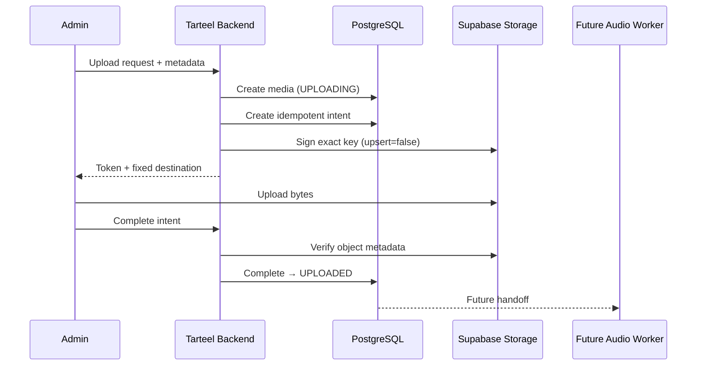

# ترتيل — Storage Architecture & Upload Foundation

## 1. Scope and principles

Supabase Storage يخزن bytes، لكن PostgreSQL هو مصدر حقيقة lifecycle. لا تعتمد أي خدمة على Storage listing لاكتشاف media. External Stations لا تدخل هذا المسار. لا تنفذ هذه المرحلة ffprobe/FFmpeg ولا تحول media إلى `READY`.



## 2. Buckets

| Bucket | Purpose | Visibility | MIME allowlist | Development limit | Access/retention |
|---|---|---|---|---:|---|
| `tarteel-media-originals` | Immutable uploaded sources | Private | MP3/M4A/AAC/WAV/FLAC MIME variants | 50 MiB | Signed upload exact key; server/worker read; archive then GC after retention |
| `tarteel-media-processed` | Future normalized variants | Private | MPEG/MP4-Audio/AAC | 50 MiB | Future worker writes; listener access via Backend-issued URL/CDN policy |
| `tarteel-artwork` | Station logos, reciter/media artwork | Public read | JPEG/PNG/WebP | 5 MiB | Public CDN retrieval; writes/deletes server-only; immutable versioned keys |

Artwork عامة لأن الصور المنشورة مقصودة لكل المستمعين ولا تحتوي admin audio. Public bucket يتجاوز authorization للقراءة فقط؛ upload/delete/copy/move تبقى محمية. SVG/GIF غير مقبولين لتقليل active-content والملفات المتحركة غير الضرورية.

لم يُنشأ temporary bucket: upload paths فريدة لكل Intent، وSupabase يرفض overwrite افتراضيًا، لذلك bucket رابعة ستضيف copy/orphan complexity بلا فائدة MVP. Upload مكتمل لكنه غير موثق يصبح cleanup candidate داخل originals ويُحذف لاحقًا عبر Storage API، لا بتعديل `storage.objects`.

الحد 50 MiB قرار DEVELOPMENT متوافق مع الحد الشائع للخطة المجانية. قبل production/long-form WAV يجب مراجعة plan/global Storage limit ورفع bucket limit بمmigration إذا لزم.

## 3. Object keys

Original key يولد server-side فقط:

```text
media/{media_id}/original/{upload_intent_id}.{extension}
```

Processed مستقبلًا:

```text
media/{media_id}/processed/{processing_profile}/{variant_id}.{extension}
```

Artwork:

```text
stations/{station_id}/logo/{asset_id}.{extension}
reciters/{reciter_id}/portrait/{asset_id}.{extension}
media/{media_id}/artwork/{asset_id}.{extension}
```

- لا يدخل filename المرسل في identity/path؛ يحفظ فقط في `original_filename` بعد رفض control chars و`/` و`\`.
- `media_id` و`intent_id` يمنعان collision وstale upload overwrite.
- `media.station_id` وintent station context يفرضان ownership؛ media العالمية On-Demand يمكن أن تكون `station_id=null`.
- object key CHECK يساوي الصيغة المولدة حرفيًا، ولا يقبل path traversal.

## 4. Upload lifecycle

1. Backend يتحقق من Auth وpermission `media.write` ومن أن station INTERNAL.
2. ينشئ `media` بحالة `UPLOADING` وبدون object path.
3. يستدعي `create_media_upload_intent` مع idempotency key وsize/MIME/extension.
4. الدالة تقفل media advisory lock، تعيد intent نفسها عند retry، وترفض intent نشطة ثانية.
5. Backend يستخدم server-only Storage client لإنشاء `createSignedUploadUrl(object_key, {upsert:false})` ثم `mark_media_upload_signed`.
6. العميل يرفع إلى الوجهة فقط؛ لا يختار bucket/path.
7. Completion endpoint يفحص object عبر Storage API ثم تستدعي الدالة `complete_media_upload`، التي تتحقق مرة أخرى من `storage.objects` metadata.
8. media تصبح `UPLOADED` فقط. Audio Worker مستقبلًا ينتقل بها إلى `PROCESSING`, ثم `READY` بعد ffprobe/processing/checksum.

`UPLOADED` أضيفت لتجنب خلط object موجود موثق مع upload لم يصل. إضافة الحالة تمت في migration منفصلة لأن PostgreSQL لا يسمح باستخدام enum value جديدة بأمان في migration transaction نفسها.

## 5. Validation

الطبقات الحالية:

- Bucket allowlist وحد الحجم.
- `storage_upload_formats` يربط extension بـMIME وحد format.
- Intent تتحقق من filename، expected size، actor، station، active media state، idempotency.
- Storage completion تتحقق من وجود object، الحجم الفعلي، MIME الفعلي، version، وعدم delete marker.
- Audio Worker لاحقًا يستخدم ffprobe/signature/codec/duration؛ MIME والامتداد ليسا إثباتًا لصوت صالح.

FLAC مقبول كـsource lossless مفيد وأصغر عادة من WAV، لكنه ليس processed/broadcast output مفترضًا.

## 6. Signed access

- إنشاء signed upload/read URLs يتم في Backend فقط باستخدام credential server-side.
- لا يخزن signed token في DB أو audit/logs.
- Intent الداخلية صالحة 15 دقيقة. Supabase signed upload token صالح ساعتين بحسب الخدمة؛ إذا وصل upload بعد انتهاء Intent، completion يرفضه ويصبح object orphan للتنظيف.
- `upsert=false` إلزامي؛ URL قديمة تكتب key تخص intent القديمة ولا تستبدل key الجديدة.
- Original admin preview/read URL المقترحة 5 دقائق؛ Worker يستخدم trusted service access. Processed listener expiry يحدد في API Phase.

## 7. Security model

- لا policies تسمح `INSERT/UPDATE/DELETE` لـ`anon` أو `authenticated` على buckets الثلاث.
- `anon` HTTP upload اختبر وفشل بـAccessDenied/RLS.
- `service_role` لا يدخل browser/mobile، وFlutter لا يصل للجداول الداخلية.
- `app.create_media_upload_intent` ودوال lifecycle `SECURITY INVOKER` وتتحقق من trusted database role.
- Public artwork لا يعني public listing/write permission؛ retrieval URL فقط عامة.
- secrets وsigned URLs ممنوعة من audit؛ audit يحتفظ IDs/key/size/failure code فقط.

## 8. Database integration

إضافات `media`: `station_id`, `original_bucket`, `original_filename`, `original_mime_type`, `original_object_version`, `upload_completed_at`، مع جعل `original_path` nullable أثناء `UPLOADING`.

`media_upload_intents` يحتفظ بالوجهة والحجم/MIME المتوقعين والactor/expiry والحالة وactual object metadata. `storage_upload_formats` allowlist relational. `upload_cleanup_candidates` view هي قائمة read-only للخدمة المستقبلية.

## 9. Concurrency and failure behavior

| حالة | السلوك |
|---|---|
| Double-click/retry same key | intent نفسها تُعاد |
| Different key بينما intent نشطة | رفض conflict |
| Two uploads same object key | `upsert=false`؛ Storage يقبل الأول ويرفض الآخر |
| Old token arrives | key intent قديمة؛ completion expired؛ cleanup لاحق |
| Partial/TUS timeout | لا media transition؛ URL تنتهي؛ cleanup reconciliation |
| Object absent/size/MIME mismatch | completion ترفض؛ intent يمكن تعليمها FAILED؛ media ليست READY |
| Storage unavailable | API يعيد retryable error؛ DB state تبقى UPLOADING/SIGNED |
| Database unavailable | لا تصدر intent؛ uploaded late object لا يعتمد دون reconciliation |
| Unsupported/oversized | رفض قبل signing وعند bucket boundary |

## 10. Cleanup and retention

- كل دقيقة/دورية مستقبلًا: تعليم intents النشطة المنتهية `EXPIRED`.
- بعد 24 ساعة: cleanup service تقرأ `upload_cleanup_candidates` وتحذف orphan عبر Storage API، ثم تسجل `OBJECT_DELETED`؛ ممنوع حذف metadata مباشرة من `storage.objects`.
- `FAILED/CANCELLED/EXPIRED` intents تحتفظ 30 يومًا للتحقيق ثم يمكن أرشفتها/حذفها.
- Media archived لا تحذف bytes فورًا؛ GC بعد 30 يومًا وبعد فحص references/history.
- Completed originals تحفظ حتى archive/retention policy؛ checksum SHA-256 يضاف بواسطة Worker ولا يمنع duplicate مشروع تلقائيًا.

## 11. Audit events

الدوال تسجل `UPLOAD_INTENT_CREATED`, `UPLOAD_COMPLETED`, `UPLOAD_FAILED`. `MEDIA_ARCHIVED` و`OBJECT_DELETED` يسجلهما Backend/cleanup عند تنفيذهما لاحقًا. لا تسجل tokens، authorization headers، أو signed URLs.

## 12. Audio Worker handoff

Worker يطالب media في `UPLOADED`، يقرأ `original_bucket/path/version`، يعمل ffprobe/codec validation ثم يكتب key جديدًا في processed bucket. نجاح upload وحده لا ينشئ processing job ولا يغير `READY`.
