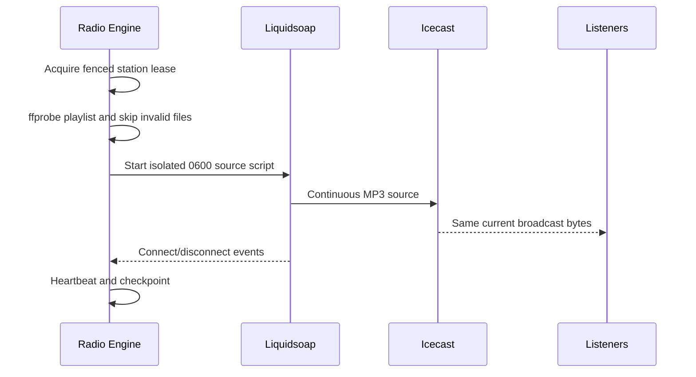

# Continuous Streaming Foundation

## Technology decision

Liquidsoap is the continuous source adapter. A custom long-running FFmpeg orchestrator was not selected.

| Criterion | Liquidsoap | Custom FFmpeg orchestration |
|---|---|---|
| Continuous playlists/fallback | Native source graph | Custom process and pipe lifecycle |
| Icecast reconnect | Native output behavior | Must be implemented and reconciled |
| Metadata/live takeover future | Native primitives | Additional orchestration |
| Content-safe transitions | Track-sensitive fallback, no crossfade | Possible but easier to break at process boundaries |
| Operational complexity | Extra purpose-built dependency | Fewer binaries, substantially more custom reliability code |

Liquidsoap 2.2.4 was executed in Development. The checked-in source uses only features compatible with that version. Liquidsoap is not the Scheduler or business Queue; the Radio Engine resolves an ordered source list and Liquidsoap renders it continuously.

## Storage format versus live format

The approved processed artifact remains AAC-LC in M4A at 96 kbps. The live source decodes it and emits one continuous MP3 stream:

| Layer | Codec/container | Bitrate | Rate/channels | Reason |
|---|---|---:|---|---|
| Processed storage | AAC-LC/M4A | 96 kbps | 44.1 kHz/stereo | Existing versioned processing profile |
| Live mount | MP3 elementary stream | 128 kbps | 44.1 kHz/stereo | Broad Android/iOS/Web/just_audio compatibility and stable Icecast semantics |

The fixed client URL is `/tarteel.mp3`; it never changes between tracks. No crossfade, tempo, pitch, clipping, or reordering is applied. The source uses `fallback(track_sensitive=true)`, so a fallback cannot mix with a Quran track.

## Phase 5 source flow

The current Phase 5 playlist is development-only: validated absolute fixture paths loop A → B → C. If none is playable, a generated 330 Hz development fallback is used. This fallback proves mechanics only and is not a production Never Silence asset.

## Proof methodology and result

Generated, non-religious tones were encoded as M4A fixtures. Real Liquidsoap decoded and continuously encoded them to MP3. Three independent FFmpeg listener processes decoded the stream to PCM; one-second zero-crossing windows identified which track each listener was receiving.

The Work sandbox could not run Icecast because it forces UID 0 and disallows Icecast's privilege drop. A minimal development proof relay accepted Liquidsoap's source connection and fanned the same incoming byte stream to listeners. It contained no playlist, seeking, transcoding, or per-listener source logic. This proves continuous-source and listener-timeline behavior, but it is not the final Icecast acceptance test.

| Observation | Actual result |
|---|---:|
| Test duration | 72.4 s |
| Listener processes | 3 |
| No-listener run before A | 5.0 s |
| A first detected tone | 421 Hz (Track A nominal 440 Hz) |
| B joined later, first tone | 423 Hz (same current Track A) |
| A/B transition observation delta | 504 ms |
| B/C later transition delta | 162 ms |
| A disconnect effect on B | None |
| Source-process recovery | 5.819 s |
| Distributor restart/reconnect | 2.282 s (proof relay, not Icecast) |
| Engine kill/restart | 5.801 s |
| Fallback detected | 330 Hz |
| Metadata | `Development Track C` |

The frequency estimator uses one-second windows, so the transition deltas include decoder/network buffering and analysis-window quantization. They do not prove sample-gapless output. No gapless claim is made.

## Metadata and Now Playing

The Engine publishes title metadata to Icecast's authenticated admin endpoint. PostgreSQL `radio.now_playing` remains the future API source of truth. In Phase 5, current/next timing is estimated from validated durations after source connection; it is not yet acknowledged by Liquidsoap at actual track start. Accurate playout acknowledgements are required before the public Now Playing API.

## Failure behavior

- Invalid track: logged and skipped before source startup.
- Empty/invalid playlist: development fallback selected.
- Source child exits: `RECOVERING`, exponential restart, maximum attempts.
- Icecast unavailable: Liquidsoap reconnects; Engine remains not-ready until connected.
- Lease lost: Engine stops issuing source output and enters `ERROR`.
- No listeners: source continues independently.
- Listener disconnect: does not control or stop source.

## Phase 5 closure test

On a normal non-root Docker/Linux host, run the same proof with `TARTEEL_TEST_USE_PROOF_RELAY` unset. Acceptance requires the result to identify `distribution_endpoint=icecast`, two delayed listeners to remain on `/tarteel.mp3` across at least two transitions, and an actual Icecast restart/reconnect measurement.

